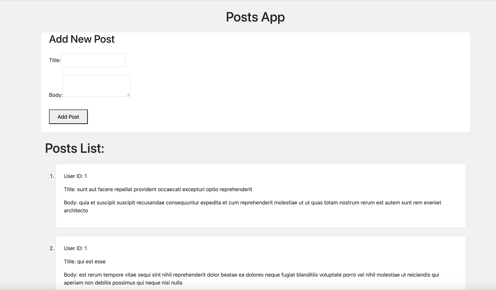
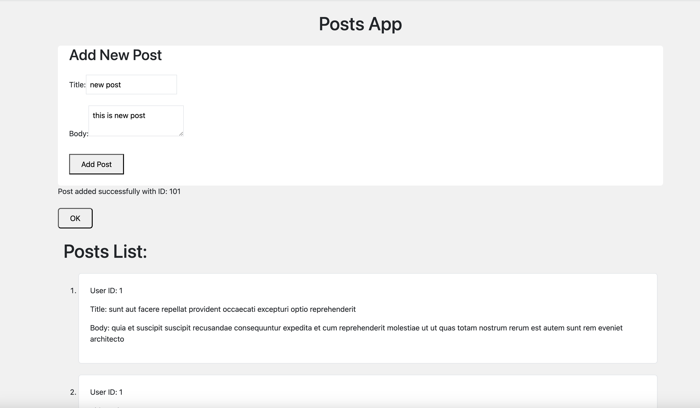

# Post App

### Project description

This project is a simple React application that fetches and displays posts from [JSONPlaceholder API](https://jsonplaceholder.typicode.com/), and allows adding new posts.

### Fetching the existing Post list from API endpoints 

- Read feature ["GET"] : Able to read list of post from API endpoints. API endpoint gives always the same data.

- Create post list feature ["POST"]: Able to add a new post list in the existing list of post items. Api is giving success but it doesnot give that newly added item next time. Created a modal that will display the response with newly created list id.

### Steps to run

To get started, follow these steps:

1. Clone this repository to your local machine.
2. Move the appropriate directory
3. Run `npm install` to install the required dependencies.
4. Run `npm run dev` to start the web server. 

### Approach

1. Redux Toolkit: Used createApi to define endpoints and manage API interactions efficiently. Also, It simplifies the data fetching and state management process.

2. TypeScript: to ensure type safety across our components and API interactions.

3. Tailwind CSS: for clean consistent UI.

4. For post request, I have used id as 1 and added a modal that will display the success or failure message as it will only mock the response but not change the actual data as per official documentation.

5. The user ID for new posts is set to 1 as a placeholder while making 'POST' requests.

### Further improvements

1. Improve error handling.

2. Add more comprehensive form validation.

3. Adding test cases for for all functionalities and components.

### Screenshots

- All Post lists anf form

- Post added success with modal response

